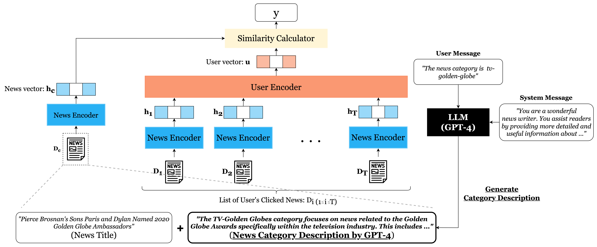

<div align="center">

# News Recommendation with <br /> Category Description by a Large Language Model

[**Yuki Yada**](https://www.yyada.jp/) and **Hayato Yamana**

</div> 

This repository is the official implementation for the paper: **News Recommendation with Category Description by a Large Language Model**. (to appear)

## Overview

<div align="center">
    
</div>

In this study, we proposed a novel approach that utilizes Large Language Models (LLMs) to automatically generate descriptive texts for news categories, which are then applied to enhance news recommendation performance. Comprehensive experiments demonstrate that our proposed method achieves a 5.8% improvement in performance compared to baselines.

**The paper is will be published soon. We will update the README with more details and a link to the paper once it becomes available.**

## Directories
```bash
$ tree -L 2
.
├── LICENSE
├── README.md
├── dataset/ # MIND dataset and its download script
│   ├── download_mind.py
│   ├── generated/
│   └── mind/
├── pyproject.toml
├── requirements-dev.lock
├── requirements.lock
├── scripts/ # Script (Bash) for the experiment
│   ├── train_naml.sh
│   ├── train_npa.sh
│   └── train_nrms.sh
├── src/
│   ├── config/ # Configuration
│   ├── const/
│   ├── evaluation/ # Evaluation Metrics: nDCG, AUC, MRR
│   │   ├── RecEvaluator.py
│   ├── experiment/ # Experiment Command
│   │   ├── generation/
│   │   └── train.py
│   ├── mind/ # Loading the dataset
│   │   ├── CategoryAugmentedMINDDataset.py
│   │   ├── MINDDataset.py
│   │   └── dataframe.py
│   ├── recommendation/ # Recommendation Models by PyTorch & Transformers
│   │   ├── __init__.py
│   │   ├── common_layers/
│   │   ├── naml/
│   │   ├── npa/
│   │   └── nrms/
│   └── utils/
└── test/ # Unit test
    ├── evaluation
    ├── mind
    └── recommendation
```

## Preparation

### Requirements

- [**Rye**](https://rye-up.com/) 

It also works with **Python v3.11.3 + pip**.

### Setup

At first, you can install dependencies by running: 

```bash
$ rye sync
```

Next, please set PYTHONPATH to environment variable:

```bash
$ export PYTHONPATH=$(pwd)/src:$(pwd)
```

### Download MIND dataset

We use **[MIND (Microsoft News Dataset)](https://msnews.github.io/)** dataset for training and validating the news recommendation model. You can download them by executing [dataset/download_mind.py](https://github.com/YadaYuki/news-recommendation-llm/blob/main/dataset/download_mind.py).


```bash
$ rye run python ./dataset/download_mind.py 
```

By executing [dataset/download_mind.py](https://github.com/YadaYuki/news-recommendation-llm/blob/main/dataset/download_mind.py), the MIND dataset will be downloaded from an external site and then extracted.

If you successfully executed, `dataset` folder will be structured as follows:

```
./dataset/
├── download_mind.py
└── mind
    ├── large
    │   ├── test
    │   ├── train
    │   └── val
    ├── small
    │   ├── train
    │   └── val
    └── zip
        ├── MINDlarge_dev.zip
        ├── MINDlarge_test.zip
        ├── MINDlarge_train.zip
        ├── MINDsmall_dev.zip
        └── MINDsmall_train.zip
```

### Generate Category Description by GPT-4

In this step, you will need an **OpenAI API_KEY**. Please follow [this document](https://platform.openai.com/docs/quickstart) to obtain an API_KEY. 

If you are unable to issue an API_KEY, the category descriptions generated in this step are already provided in the repository ([**`category_description_gpt4.json`**](https://github.com/yamanalab/gpt-augmented-news-recommendation/blob/main/dataset/generated/category_description_gpt4.json)), so please use this.

At first, please set OpenAI API_KEY to environment variable:

```bash
$ export OPENAI_API_KEY={YOUR_OPENAI_API_KEY}
```

Then, generate category description by running:

```bash
$ rye run python ./src/experiment/generation/gpt_based_text_generation.py
```

After executing this code, you can confirm that the file `category_description_gpt4.json` has been generated under the `dataset/generated` directory.

## Experiments

### Train & Evaluate Models

By executing [**`train.py`**](https://github.com/yamanalab/gpt-augmented-news-recommendation/blob/main/src/experiment/train.py), you can train and evaluate the news recommendation model.

To train and evaluate all models(***NAML, NRMS, NPA*** + ***BERT, DistilBERT***) and methods(***title only***, ***template-based***, ***generated-description***), please execute following commands: 

```bash
$ rye run python src/experiment/train.py -m pretrained="distilbert-base-uncased","bert-base-uncased" gradient_accumulation_steps=16 batch_size=8 augmentation_method=GPT4,TEMPLATE_BASED,NONE news_recommendation_model=NAML,NRMS,NPA max_len=64
```

If you want to try a specific model or method individually, you can specify it using arguments when running train.py.


- **`recommendation_model(NAML,NRMS,NPA)`**: Specifies the recommendation model.
- **`pretrained("distilbert-base-uncased","bert-base-uncased")`**: Specifies the pre-trained model.
- **`augmentation_method(GPT4,TEMPLATE_BASED,NONE)`**: Specifies the augmentation method for the input text.

For example, if you want to try **`generated-description`** with **`NPA + DistilBERT`**, please run the following command:

```bash
$ rye run python src/experiment/train.py -m pretrained="distilbert-base-uncased" gradient_accumulation_steps=16 batch_size=8 augmentation_method=GPT4 news_recommendation_model=NPA max_len=64
```

### Evaluation Result


| Rec Model | PLM | Method | AUC | MRR | nDCG@5 | nDCG@10 |
|----------------------|------------------|--------------------------------|-------|-------|--------|---------|
| NAML | DistilBERT | *title only* | 0.675 | 0.292 | 0.317 | 0.384 |
|  |  | *title + template-based* | 0.690 | 0.295 | 0.327 | 0.393 |
|  |  | *title + generate-description* (ours) | **0.713** | **0.326** | **0.363** | **0.425** |
|  | BERT | *title only* | 0.700 | 0.318 | 0.350 | 0.414 |
|  |  | *title + template-based* | 0.696 | 0.308 | 0.340 | 0.405 |
|  |  | *title + generate-description* (ours) | **0.707** | **0.322** | **0.357** | **0.420** |
| NRMS | DistilBERT | *title only* | 0.674 | 0.297 | 0.322 | 0.387 |
|  |  | *title + template-based* | 0.675 | 0.311 | 0.341 | 0.400 |
|  |  | *title + generate-description* (ours) | **0.707** | **0.324** | **0.359** | **0.422** |
|  | BERT | *title only* | 0.689 | 0.306 | 0.336 | 0.400 |
|  |  | *title + template-based* | 0.667 | 0.301 | 0.329 | 0.389 |
|  |  | *title + generate-description* (ours) | **0.706** | **0.320** | **0.355** | **0.418** |
| NPA | DistilBERT | *title only* | 0.700 | 0.311 | 0.344 | 0.408 |
|  |  | *title + template-based* | 0.698 | 0.309 | 0.342 | 0.407 |
|  |  | *title + generate-description* (ours) | **0.707** | **0.319** | **0.354** | **0.417** |
|  | BERT | *title only* | 0.689 | 0.301 | 0.332 | 0.398 |
|  |  | *title + template-based* | 0.694 | 0.314 | 0.345 | 0.410 |
|  |  | *title + generate-description* (ours) | **0.710** | **0.324** | **0.360** | **0.422** |


## Citation

TBD
